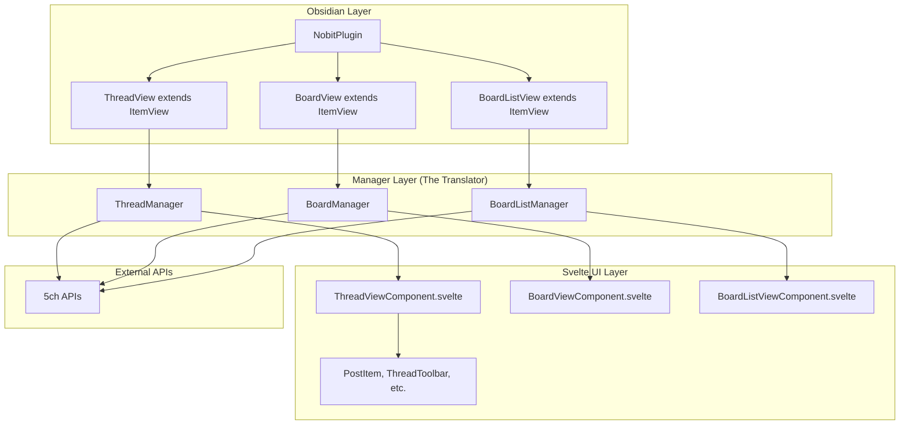

# Design Document

## Overview

This design document outlines the architecture for a lightweight, performant, and hackable 5ch-compatible browser implemented as an Obsidian plugin. The core principle is the strict separation between Obsidian's class-based world and Svelte's reactive UI world through a Manager layer pattern. This design is informed by three previous prototyping attempts and focuses on creating a maintainable, testable architecture that can be incrementally developed starting with a ruthless MVP.

## Architecture

### Core Architectural Principle: The Manager Layer Pattern

The fundamental challenge this design solves is bridging the gap between "class-based Obsidian" and "function-based Svelte" worlds. The Manager layer acts as a "translator" that:

1. **Encapsulates all Obsidian API interactions** within Manager classes
2. **Manages application state** using Svelte 5's `$state` reactivity
3. **Provides a clean interface** for Svelte components to consume data and trigger actions
4. **Ensures Svelte components never directly import from 'obsidian'**

### Dependency Flow

```
main.ts (Obsidian Plugin) → Manager.ts (Class with $state) → View.ts (Bridge) → Component.svelte (Pure UI)
```

### High-Level Architecture Diagram



## Components and Interfaces

### 0. Existing 5ch Communication Infrastructure (Already Implemented & Tested)

The project already includes a comprehensive 5ch communication and decoding layer:

#### ObsidianFetcher
**Responsibility:** Obsidian-compatible HTTP client with rate limiting
- Implements `HttpFetcher` interface using Obsidian's `requestUrl` API
- Built-in `RequestQueue` with 300ms delay for rate limiting
- Proper error handling with `HttpError` class
- Supports both GET and POST requests

#### libch Package Components
**Responsibility:** 5ch-specific parsing and decoding logic

- **`BufferDecoder`**: Handles Shift-JIS decoding for 5ch responses
- **`DefaultParser`**: Parses 5ch DAT files, subject.txt, and BBS menu HTML
- **`HttpFetcher` Interface**: Abstraction for network requests (implemented by ObsidianFetcher)
- **URL Utilities**: 5ch URL parsing and validation
- **Type Definitions**: Complete type system for 5ch data structures

**Key Features**:
- Shift-JIS text decoding for Japanese content
- DAT file parsing with post relationship analysis
- HTML entity decoding
- Anchor link processing (>>1 style references)
- Image URL extraction
- Rate limiting and error handling

### 1. Manager Layer Components

#### ThreadManager Class
**Responsibility:** Manages thread-specific state and operations using existing 5ch infrastructure

```typescript
class ThreadManager {
  // Reactive state using Svelte 5's $state
  thread = $state<Thread | null>(null);
  isLoading = $state<boolean>(false);
  error = $state<string | null>(null);
  filters = $state<ThreadFilters>(defaultFilters);
  
  private fetcher: ObsidianFetcher;
  private decoder: DefaultDecoder;
  private parser: DefaultParser;
  
  constructor(private app: App) {
    this.fetcher = new ObsidianFetcher(300); // 300ms rate limiting
    this.decoder = new DefaultDecoder();
    this.parser = new DefaultParser();
  }
  
  // Public interface methods leveraging existing infrastructure
  async loadThread(url: string): Promise<void> {
    this.isLoading = true;
    this.error = null;
    
    try {
      // Use existing ObsidianFetcher with rate limiting
      const buffer = await this.fetcher.fetch(url);
      
      // Use existing decoder for Shift-JIS
      const datContent = this.decoder.decode(buffer);
      
      // Use existing parser for 5ch DAT format
      const threadId = extractThreadIdFromUrl(url);
      const parsedThread = this.parser.parseThread(datContent, threadId, url);
      
      if (parsedThread) {
        this.thread = parsedThread;
      } else {
        throw new Error('Failed to parse thread data');
      }
    } catch (error) {
      this.error = `スレッドの読み込みに失敗しました: ${error.message}`;
    } finally {
      this.isLoading = false;
    }
  }
  
  async refreshThread(): Promise<void>
  async postToThread(postData: PostData): Promise<PostResult>
  updateFilters(newFilters: Partial<ThreadFilters>): void
  jumpToPost(resNumber: number): void
}
```

#### BoardManager Class
**Responsibility:** Manages board-specific state and operations using existing 5ch infrastructure

```typescript
class BoardManager {
  boardThreads = $state<SubjectItem[]>([]);
  currentBoard = $state<Board | null>(null);
  isLoading = $state<boolean>(false);
  error = $state<string | null>(null);
  
  private fetcher: ObsidianFetcher;
  private decoder: DefaultDecoder;
  private parser: DefaultParser;
  
  constructor(private app: App) {
    this.fetcher = new ObsidianFetcher(300);
    this.decoder = new DefaultDecoder();
    this.parser = new DefaultParser();
  }
  
  async loadBoard(boardUrl: string): Promise<void> {
    this.isLoading = true;
    this.error = null;
    
    try {
      // Fetch subject.txt using existing infrastructure
      const subjectUrl = `${boardUrl}/subject.txt`;
      const buffer = await this.fetcher.fetch(subjectUrl);
      const subjectContent = this.decoder.decode(buffer);
      
      // Parse using existing parser
      this.boardThreads = this.parser.parseSubject(subjectContent);
      this.currentBoard = { name: extractBoardName(boardUrl), url: boardUrl };
    } catch (error) {
      this.error = `板の読み込みに失敗しました: ${error.message}`;
    } finally {
      this.isLoading = false;
    }
  }
  
  async refreshBoard(): Promise<void>
  openThread(threadId: string): void
}
```

#### BoardListManager Class
**Responsibility:** Manages board list state and navigation using existing 5ch infrastructure

```typescript
class BoardListManager {
  bbsMenu = $state<BBSMenu>([]);
  isLoading = $state<boolean>(false);
  error = $state<string | null>(null);
  
  private fetcher: ObsidianFetcher;
  private decoder: DefaultDecoder;
  private parser: DefaultParser;
  
  constructor(private app: App) {
    this.fetcher = new ObsidianFetcher(300);
    this.decoder = new DefaultDecoder();
    this.parser = new DefaultParser();
  }
  
  async loadBoardList(): Promise<void> {
    this.isLoading = true;
    this.error = null;
    
    try {
      // Fetch BBS menu using existing infrastructure
      const menuUrl = 'https://menu.5ch.net/bbsmenu.html';
      const buffer = await this.fetcher.fetch(menuUrl);
      const menuHtml = this.decoder.decode(buffer);
      
      // Parse using existing parser
      this.bbsMenu = this.parser.parseBBSMenu(menuHtml);
    } catch (error) {
      this.error = `板一覧の読み込みに失敗しました: ${error.message}`;
    } finally {
      this.isLoading = false;
    }
  }
  
  openBoard(board: Board): void
}
```

### 2. View Layer Components

#### ThreadView (Obsidian ItemView Bridge) - MVP Focus
**Responsibility:** Bridge between Obsidian and Svelte for thread display

```typescript
export class ThreadView extends ItemView {
  private threadManager: ThreadManager;
  private component: ReturnType<typeof mount> | null = null;
  
  constructor(leaf: WorkspaceLeaf, plugin: NobitPlugin) {
    super(leaf);
    // Initialize manager with Obsidian app instance
    this.threadManager = new ThreadManager(this.app);
  }
  
  getViewType() {
    return VIEW_TYPE_THREAD;
  }
  
  getDisplayText() {
    return "5ch Thread";
  }
  
  async onOpen() {
    // Mount Svelte component with manager injected via context
    this.component = mount(ThreadViewComponent, {
      target: this.contentEl,
      props: {}
    });
    
    // Set context for Svelte component
    setContext('threadManager', this.threadManager);
  }
  
  async onClose() {
    this.component && unmount(this.component);
  }
}
```

**Future ItemViews** (same pattern):
- `BoardView extends ItemView` → `BoardViewComponent.svelte`
- `BoardListView extends ItemView` → `BoardListViewComponent.svelte`
```

### 3. Svelte UI Components

#### Individual ItemView Components
**Responsibility:** Each view is a separate Obsidian ItemView with its own Svelte component

**No App.svelte needed** - Obsidian handles routing between different ItemViews. Each view is completely independent:

- `ThreadView` (ItemView) → `ThreadView.svelte` (Svelte component)
- `BoardView` (ItemView) → `BoardView.svelte` (Svelte component)  
- `BoardListView` (ItemView) → `BoardListView.svelte` (Svelte component)

#### ThreadViewComponent.svelte (MVP Focus)
**Responsibility:** Main thread display component (mounted by ThreadView ItemView)

```svelte
<script lang="ts">
  import { getContext, onMount } from 'svelte';
  import PostItem from './thread/PostItem.svelte';
  import ThreadToolbar from './thread/ThreadToolbar.svelte';
  import ThreadFilters from './thread/ThreadFilters.svelte';
  
  const threadManager = getContext<ThreadManager>('threadManager');
  
  onMount(async () => {
    // MVP: Load hardcoded thread URL
    await threadManager.loadThread('https://example.5ch.net/test/read.cgi/board/1234567890/');
  });
</script>

<div class="thread-view">
  <ThreadFilters 
    filters={threadManager.filters}
    onUpdateFilters={threadManager.updateFilters.bind(threadManager)}
  />
  
  {#if threadManager.isLoading}
    <div class="loading">Loading thread...</div>
  {:else if threadManager.error}
    <div class="error">{threadManager.error}</div>
  {:else if threadManager.thread}
    <div class="thread-content">
      <h2>{threadManager.thread.title}</h2>
      <div class="posts">
        {#each threadManager.thread.posts as post, index}
          <PostItem 
            {post} 
            {index}
            onJumpToPost={threadManager.jumpToPost.bind(threadManager)}
          />
        {/each}
      </div>
    </div>
  {/if}
  
  <ThreadToolbar 
    onRefresh={threadManager.refreshThread.bind(threadManager)}
  />
</div>
```

### 4. Existing Components Integration

The design leverages existing thread components:
- **PostItem.svelte**: Already implements post display with interaction handlers
- **ThreadToolbar.svelte**: Provides refresh and write functionality
- **ThreadFilters.svelte**: Handles thread filtering options
- **InlineWriteForm.svelte**: Manages post composition
- **PostTree.svelte**: Displays reply relationships

## Data Models

The design uses existing type definitions from `src/lib/types.ts`:

### Core Data Types
- **Thread**: Contains title, posts array, and URL
- **Post**: Individual post with content, metadata, and relationships
- **Board**: Board information with name and URL
- **SubjectItem**: Thread list item with ID, title, and response count
- **ThreadFilters**: Filter state for thread display options

### State Management Pattern
All reactive state is managed within Manager classes using Svelte 5's `$state`:

```typescript
// Manager classes own the state
class ThreadManager {
  thread = $state<Thread | null>(null);
  isLoading = $state<boolean>(false);
  // ... other state
}

// Svelte components consume reactive state
const threadManager = getContext<ThreadManager>('threadManager');
// Automatically reactive: threadManager.thread, threadManager.isLoading
```

## Error Handling

### Network Error Handling
- **Retry Logic**: Exponential backoff for failed requests
- **Timeout Handling**: Configurable request timeouts
- **Rate Limiting**: Respect 5ch server limitations
- **Offline Detection**: Handle network unavailability

### User Error Feedback
- **Loading States**: Clear loading indicators in UI
- **Error Messages**: User-friendly error descriptions
- **Fallback Content**: Graceful degradation when data unavailable
- **Recovery Actions**: Allow users to retry failed operations

### Error Boundaries
```typescript
class ThreadManager {
  private async handleNetworkError(error: Error): Promise<void> {
    this.error = this.formatUserFriendlyError(error);
    this.isLoading = false;
    // Log technical details for debugging
    logger.error('Thread loading failed:', error);
  }
}
```

## Testing Strategy

### 1. Unit Tests (Vitest) - Foundation Layer
**Focus**: Manager class logic and pure functions
**Approach**: Test public interfaces, not implementation details to ensure refactoring resilience

**Current Setup**:
- Vitest 3.2.4 with TypeScript support and native ES modules
- Configuration in `vitest.config.ts`
- Focus on testing Manager class public interfaces

```typescript
// Example: ThreadManager.test.ts
describe('ThreadManager', () => {
  let mockApp: App;
  let threadManager: ThreadManager;
  
  beforeEach(() => {
    mockApp = createMockObsidianApp();
    threadManager = new ThreadManager(mockApp);
  });
  
  // Test public interface behavior, not internal implementation
  it('should load thread and update reactive state', async () => {
    const testUrl = 'https://example.5ch.net/test/read.cgi/board/1234567890/';
    
    await threadManager.loadThread(testUrl);
    
    // Test observable state changes, not internal methods
    expect(threadManager.thread).toBeDefined();
    expect(threadManager.isLoading).toBe(false);
    expect(threadManager.error).toBeNull();
  });
  
  it('should handle network errors gracefully', async () => {
    // Mock network failure
    mockApp.vault.adapter.read.mockRejectedValue(new Error('Network error'));
    
    await threadManager.loadThread('invalid-url');
    
    expect(threadManager.error).toContain('Network error');
    expect(threadManager.thread).toBeNull();
  });
});
```

### 2. Component Tests (Storybook) - Isolation Layer
**Focus**: UI components in isolation from Obsidian
**Approach**: Develop and test components with mock data using Storybook 9.1.10 with Svelte CSF

**Current Setup**: 
- Storybook 9.1.10 with `@storybook/addon-svelte-csf`
- Svelte 5 compatible with `defineMeta` pattern
- Stories located in `src/stories/` directory

```svelte
<!-- Example: PostItem.stories.svelte -->
<script module>
  import { defineMeta } from "@storybook/addon-svelte-csf";
  import PostItem from "../../view/thread/PostItem.svelte";
  import { fn } from "storybook/test";

  const { Story } = defineMeta({
    title: "Thread/PostItem",
    component: PostItem,
    tags: ["autodocs"],
    argTypes: {
      post: { control: false, description: "表示するポストオブジェクト" },
      index: { control: { type: "number", min: 0, max: 1000 } },
      onJumpToPost: { action: "onJumpToPost" },
    },
  });
</script>

<Story
  name="Default"
  args={{
    post: generateBasicPost(),
    index: 0,
    onJumpToPost: fn(),
  }}
/>
```

**Existing Stories**: Already implemented for thread components:
- `PostItem.stories.svelte` - Comprehensive post display testing
- `ThreadFilters.stories.svelte` - Filter component testing
- `PostTree.stories.svelte` - Reply tree visualization
- `InlineWriteForm.stories.svelte` - Post composition form

### 3. E2E Tests (Playwright) - Integration Layer
**Focus**: Complete user flows with mocked network requests
**Approach**: Test real user interactions in mock Obsidian environment using existing infrastructure

**Current Setup**:
- Playwright 1.55.1 with GitHub Actions integration
- Configuration in `playwright.config.ts`
- Uses `obsidian-testing-toolkit` for Obsidian environment simulation
- Network mocking for deterministic 5ch API responses

```typescript
// Example: thread-view.spec.ts
import { test, expect } from '@playwright/test';

test('should display hardcoded thread content in MVP', async ({ page }) => {
  // Mock 5ch API responses for deterministic testing
  await page.route('**/test/read.cgi/**', route => {
    route.fulfill({ 
      status: 200,
      contentType: 'text/html; charset=Shift_JIS',
      body: mockThreadHtml 
    });
  });
  
  // Open Obsidian and activate thread view
  await page.goto('/');
  await page.getByRole('button', { name: 'Open Nobit Test Thread' }).click();
  
  // Verify thread content is displayed
  await expect(page.locator('.thread-content')).toBeVisible();
  await expect(page.locator('.post')).toHaveCount(10);
  await expect(page.locator('h2')).toContainText('テストスレッド');
  
  // Verify Manager layer → Svelte UI communication
  await expect(page.locator('.loading')).not.toBeVisible();
  await expect(page.locator('.error')).not.toBeVisible();
});

test('should handle network errors gracefully', async ({ page }) => {
  // Mock network failure
  await page.route('**/test/read.cgi/**', route => {
    route.abort('failed');
  });
  
  await page.goto('/');
  await page.getByRole('button', { name: 'Open Nobit Test Thread' }).click();
  
  await expect(page.locator('.error')).toBeVisible();
  await expect(page.locator('.error')).toContainText('ネットワークエラー');
});
```

## MVP Implementation Strategy

### Phase 1: Ruthless MVP (v0.0.1)
**Goal**: Validate Manager layer architecture with minimal functionality using existing 5ch infrastructure

**Scope**:
1. Single hardcoded thread URL in ThreadManager using existing ObsidianFetcher + DefaultParser
2. Basic ThreadViewComponent.svelte displaying posts using existing PostItem components
3. No navigation, no board lists, no user input
4. Focus on proving Manager ↔ Svelte communication works with real 5ch data
5. Leverage existing Storybook stories and 5ch communication layer

**Success Criteria**:
- Command "Open Nobit Test Thread" opens ThreadView ItemView
- ThreadView fetches and displays real 5ch thread data using existing infrastructure
- ObsidianFetcher handles rate limiting and Shift-JIS decoding automatically
- DefaultParser correctly processes DAT format and post relationships
- No Svelte component imports from 'obsidian' (strict architectural separation)
- ThreadManager uses Svelte 5's `$state` for reactive state management
- Basic E2E test passes with mocked 5ch responses
- Existing thread components (PostItem, ThreadToolbar, etc.) integrate seamlessly

**Development Workflow for MVP**:
1. **Logic First**: Implement ThreadManager using existing ObsidianFetcher/DefaultParser with unit tests
2. **UI in Isolation**: Verify existing components work in Storybook with real 5ch data structures
3. **Integrate & Verify**: Create ThreadView ItemView and validate with E2E tests using network mocks

**Advantages of Existing Infrastructure**:
- No need to implement HTTP client, rate limiting, or Shift-JIS decoding
- Proven 5ch DAT parsing and post relationship analysis
- Existing error handling and network resilience
- Type-safe 5ch data structures already defined

### Phase 2: Dynamic Thread Loading (v0.0.2)
**Scope**:
1. Add thread URL input capability
2. Implement error handling and loading states
3. Add refresh functionality

### Phase 3: Board Navigation (v0.0.3)
**Scope**:
1. Implement BoardView and BoardListView
2. Add navigation between views
3. Complete the browsing flow

## Performance Considerations

### Caching Strategy
- **Thread Cache**: Cache loaded threads to avoid redundant requests
- **Board Cache**: Cache board lists with TTL
- **Image Lazy Loading**: Load images on demand

### Memory Management
- **Component Cleanup**: Proper unmounting of Svelte components
- **State Cleanup**: Clear large data structures when not needed
- **Event Listener Cleanup**: Remove event listeners on component destroy

### Future Optimizations
- **Virtual Scrolling**: For very long threads (post-MVP)
- **Incremental Loading**: Load posts in chunks
- **Background Refresh**: Update threads in background

## Security Considerations

### Content Sanitization
- **HTML Sanitization**: Sanitize post content before rendering
- **XSS Prevention**: Validate and escape user inputs
- **Image Validation**: Validate image URLs and content

### Network Security
- **HTTPS Enforcement**: Ensure secure connections to 5ch
- **Request Validation**: Validate all outgoing requests
- **Rate Limiting**: Prevent abuse of 5ch servers

## Deployment and Configuration

### Plugin Configuration
- **Default Settings**: Sensible defaults for 5ch servers
- **User Customization**: Allow users to configure servers and behavior
- **Settings Persistence**: Store settings in Obsidian's data system

### Development Workflow
1. **Logic First**: Implement Manager class with unit tests focusing on public interfaces
2. **UI in Isolation**: Leverage existing Storybook stories and develop new components in isolation
3. **Integrate & Verify**: Connect layers and validate with E2E tests using Playwright network mocking

### Technology Stack Summary
- **Obsidian Plugin**: TypeScript with strict mode
- **UI Framework**: Svelte 5 with reactive `$state` 
- **Component Development**: Storybook 9.1.10 with Svelte CSF addon
- **Unit Testing**: Vitest 2.1.9 with native TypeScript and ES modules support
- **E2E Testing**: Playwright 1.55.1 with obsidian-testing-toolkit
- **Build System**: esbuild with Svelte plugin
- **Code Quality**: Biome for formatting and linting

This design provides a solid foundation for incremental development while maintaining the architectural principles learned from three previous prototyping attempts. The existing Storybook infrastructure and component library provide a significant head start for the MVP implementation.