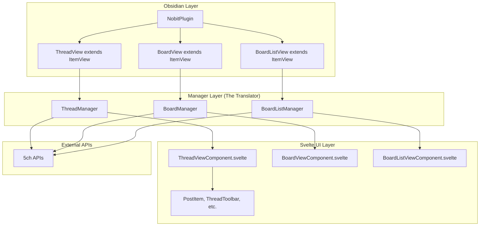

# Design Document

## Overview

This design document outlines the architecture for a lightweight, performant, and hackable 5ch-compatible browser implemented as an Obsidian plugin. The core principle is the strict separation between Obsidian's class-based world and Svelte's reactive UI world through a Manager layer pattern. This design is informed by three previous prototyping attempts and focuses on creating a maintainable, testable architecture that can be incrementally developed starting with a ruthless MVP.

## Architecture

### Core Architectural Principle: The Manager Layer Pattern

The fundamental challenge this design solves is bridging the gap between "class-based Obsidian" and "function-based Svelte" worlds. The Manager layer acts as a "translator" that:

1. **Encapsulates all Obsidian API interactions** within Manager classes
2. **Manages application state** using Svelte 5's `$state` reactivity
3. **Provides a clean interface** for Svelte components to consume data and trigger actions
4. **Ensures Svelte components never directly import from 'obsidian'**

### Dependency Flow

```
main.ts (Obsidian Plugin) → Manager.ts (Class with $state) → View.ts (Bridge) → Component.svelte (Pure UI)
```

### High-Level Architecture Diagram



## Components and Interfaces

### 1. Manager Layer Components

#### ThreadManager Class
**Responsibility:** Manages thread-specific state and operations

```typescript
class ThreadManager {
  // Reactive state using Svelte 5's $state
  thread = $state<Thread | null>(null);
  isLoading = $state<boolean>(false);
  error = $state<string | null>(null);
  filters = $state<ThreadFilters>(defaultFilters);
  
  constructor(private app: App) {}
  
  // Public interface methods
  async loadThread(url: string): Promise<void>
  async refreshThread(): Promise<void>
  async postToThread(postData: PostData): Promise<PostResult>
  updateFilters(newFilters: Partial<ThreadFilters>): void
  jumpToPost(resNumber: number): void
}
```

#### BoardManager Class
**Responsibility:** Manages board-specific state and operations

```typescript
class BoardManager {
  boardThreads = $state<SubjectItem[]>([]);
  currentBoard = $state<Board | null>(null);
  isLoading = $state<boolean>(false);
  error = $state<string | null>(null);
  
  constructor(private app: App) {}
  
  async loadBoard(boardUrl: string): Promise<void>
  async refreshBoard(): Promise<void>
  openThread(threadId: string): void
}
```

#### BoardListManager Class
**Responsibility:** Manages board list state and navigation

```typescript
class BoardListManager {
  bbsMenu = $state<BBSMenu>([]);
  isLoading = $state<boolean>(false);
  error = $state<string | null>(null);
  
  constructor(private app: App) {}
  
  async loadBoardList(): Promise<void>
  openBoard(board: Board): void
}
```

### 2. View Layer Components

#### ThreadView (Obsidian ItemView Bridge) - MVP Focus
**Responsibility:** Bridge between Obsidian and Svelte for thread display

```typescript
export class ThreadView extends ItemView {
  private threadManager: ThreadManager;
  private component: ReturnType<typeof mount> | null = null;
  
  constructor(leaf: WorkspaceLeaf, plugin: NobitPlugin) {
    super(leaf);
    // Initialize manager with Obsidian app instance
    this.threadManager = new ThreadManager(this.app);
  }
  
  getViewType() {
    return VIEW_TYPE_THREAD;
  }
  
  getDisplayText() {
    return "5ch Thread";
  }
  
  async onOpen() {
    // Mount Svelte component with manager injected via context
    this.component = mount(ThreadViewComponent, {
      target: this.contentEl,
      props: {}
    });
    
    // Set context for Svelte component
    setContext('threadManager', this.threadManager);
  }
  
  async onClose() {
    this.component && unmount(this.component);
  }
}
```

**Future ItemViews** (same pattern):
- `BoardView extends ItemView` → `BoardViewComponent.svelte`
- `BoardListView extends ItemView` → `BoardListViewComponent.svelte`
```

### 3. Svelte UI Components

#### Individual ItemView Components
**Responsibility:** Each view is a separate Obsidian ItemView with its own Svelte component

**No App.svelte needed** - Obsidian handles routing between different ItemViews. Each view is completely independent:

- `ThreadView` (ItemView) → `ThreadView.svelte` (Svelte component)
- `BoardView` (ItemView) → `BoardView.svelte` (Svelte component)  
- `BoardListView` (ItemView) → `BoardListView.svelte` (Svelte component)

#### ThreadViewComponent.svelte (MVP Focus)
**Responsibility:** Main thread display component (mounted by ThreadView ItemView)

```svelte
<script lang="ts">
  import { getContext, onMount } from 'svelte';
  import PostItem from './thread/PostItem.svelte';
  import ThreadToolbar from './thread/ThreadToolbar.svelte';
  import ThreadFilters from './thread/ThreadFilters.svelte';
  
  const threadManager = getContext<ThreadManager>('threadManager');
  
  onMount(async () => {
    // MVP: Load hardcoded thread URL
    await threadManager.loadThread('https://example.5ch.net/test/read.cgi/board/1234567890/');
  });
</script>

<div class="thread-view">
  <ThreadFilters 
    filters={threadManager.filters}
    onUpdateFilters={threadManager.updateFilters.bind(threadManager)}
  />
  
  {#if threadManager.isLoading}
    <div class="loading">Loading thread...</div>
  {:else if threadManager.error}
    <div class="error">{threadManager.error}</div>
  {:else if threadManager.thread}
    <div class="thread-content">
      <h2>{threadManager.thread.title}</h2>
      <div class="posts">
        {#each threadManager.thread.posts as post, index}
          <PostItem 
            {post} 
            {index}
            onJumpToPost={threadManager.jumpToPost.bind(threadManager)}
          />
        {/each}
      </div>
    </div>
  {/if}
  
  <ThreadToolbar 
    onRefresh={threadManager.refreshThread.bind(threadManager)}
  />
</div>
```

### 4. Existing Components Integration

The design leverages existing thread components:
- **PostItem.svelte**: Already implements post display with interaction handlers
- **ThreadToolbar.svelte**: Provides refresh and write functionality
- **ThreadFilters.svelte**: Handles thread filtering options
- **InlineWriteForm.svelte**: Manages post composition
- **PostTree.svelte**: Displays reply relationships

## Data Models

The design uses existing type definitions from `src/lib/types.ts`:

### Core Data Types
- **Thread**: Contains title, posts array, and URL
- **Post**: Individual post with content, metadata, and relationships
- **Board**: Board information with name and URL
- **SubjectItem**: Thread list item with ID, title, and response count
- **ThreadFilters**: Filter state for thread display options

### State Management Pattern
All reactive state is managed within Manager classes using Svelte 5's `$state`:

```typescript
// Manager classes own the state
class ThreadManager {
  thread = $state<Thread | null>(null);
  isLoading = $state<boolean>(false);
  // ... other state
}

// Svelte components consume reactive state
const threadManager = getContext<ThreadManager>('threadManager');
// Automatically reactive: threadManager.thread, threadManager.isLoading
```

## Error Handling

### Network Error Handling
- **Retry Logic**: Exponential backoff for failed requests
- **Timeout Handling**: Configurable request timeouts
- **Rate Limiting**: Respect 5ch server limitations
- **Offline Detection**: Handle network unavailability

### User Error Feedback
- **Loading States**: Clear loading indicators in UI
- **Error Messages**: User-friendly error descriptions
- **Fallback Content**: Graceful degradation when data unavailable
- **Recovery Actions**: Allow users to retry failed operations

### Error Boundaries
```typescript
class ThreadManager {
  private async handleNetworkError(error: Error): Promise<void> {
    this.error = this.formatUserFriendlyError(error);
    this.isLoading = false;
    // Log technical details for debugging
    logger.error('Thread loading failed:', error);
  }
}
```

## Testing Strategy

### 1. Unit Tests (Jest) - Foundation Layer
**Focus**: Manager class logic and pure functions
**Approach**: Test public interfaces, not implementation details

```typescript
// Example: ThreadManager.test.ts
describe('ThreadManager', () => {
  let mockApp: jest.Mocked<App>;
  let threadManager: ThreadManager;
  
  beforeEach(() => {
    mockApp = createMockObsidianApp();
    threadManager = new ThreadManager(mockApp);
  });
  
  it('should load thread and update state', async () => {
    // Test public interface behavior
    await threadManager.loadThread('test-url');
    expect(threadManager.thread).toBeDefined();
    expect(threadManager.isLoading).toBe(false);
  });
});
```

### 2. Component Tests (Storybook) - Isolation Layer
**Focus**: UI components in isolation from Obsidian
**Approach**: Develop and test components with mock data

```typescript
// Example: PostItem.stories.ts
export default {
  title: 'Thread/PostItem',
  component: PostItem,
};

export const Default = {
  args: {
    post: mockPost,
    index: 0,
    onJumpToPost: action('jumpToPost'),
  },
};
```

### 3. E2E Tests (Playwright) - Integration Layer
**Focus**: Complete user flows with mocked network requests
**Approach**: Test real user interactions in mock Obsidian environment

```typescript
// Example: thread-view.spec.ts
test('should display thread content', async ({ page }) => {
  // Mock 5ch API responses
  await page.route('**/test/read.cgi/**', route => {
    route.fulfill({ json: mockThreadData });
  });
  
  await page.goto('/');
  await page.click('[data-testid="open-thread"]');
  
  await expect(page.locator('.thread-content')).toBeVisible();
  await expect(page.locator('.post')).toHaveCount(10);
});
```

## MVP Implementation Strategy

### Phase 1: Ruthless MVP (v0.0.1)
**Goal**: Validate Manager layer architecture with minimal functionality

**Scope**:
1. Single hardcoded thread URL in ThreadManager
2. Basic ThreadView.svelte displaying posts
3. No navigation, no board lists, no user input
4. Focus on proving Manager ↔ Svelte communication works

**Success Criteria**:
- Command "Open Nobit Test Thread" opens ThreadView
- ThreadView displays posts from hardcoded URL
- No Svelte component imports from 'obsidian'
- Basic E2E test passes

### Phase 2: Dynamic Thread Loading (v0.0.2)
**Scope**:
1. Add thread URL input capability
2. Implement error handling and loading states
3. Add refresh functionality

### Phase 3: Board Navigation (v0.0.3)
**Scope**:
1. Implement BoardView and BoardListView
2. Add navigation between views
3. Complete the browsing flow

## Performance Considerations

### Caching Strategy
- **Thread Cache**: Cache loaded threads to avoid redundant requests
- **Board Cache**: Cache board lists with TTL
- **Image Lazy Loading**: Load images on demand

### Memory Management
- **Component Cleanup**: Proper unmounting of Svelte components
- **State Cleanup**: Clear large data structures when not needed
- **Event Listener Cleanup**: Remove event listeners on component destroy

### Future Optimizations
- **Virtual Scrolling**: For very long threads (post-MVP)
- **Incremental Loading**: Load posts in chunks
- **Background Refresh**: Update threads in background

## Security Considerations

### Content Sanitization
- **HTML Sanitization**: Sanitize post content before rendering
- **XSS Prevention**: Validate and escape user inputs
- **Image Validation**: Validate image URLs and content

### Network Security
- **HTTPS Enforcement**: Ensure secure connections to 5ch
- **Request Validation**: Validate all outgoing requests
- **Rate Limiting**: Prevent abuse of 5ch servers

## Deployment and Configuration

### Plugin Configuration
- **Default Settings**: Sensible defaults for 5ch servers
- **User Customization**: Allow users to configure servers and behavior
- **Settings Persistence**: Store settings in Obsidian's data system

### Development Workflow
1. **Logic First**: Implement Manager class with unit tests
2. **UI in Isolation**: Develop Svelte components in Storybook
3. **Integrate & Verify**: Connect layers and validate with E2E tests

This design provides a solid foundation for incremental development while maintaining the architectural principles learned from previous prototyping attempts.